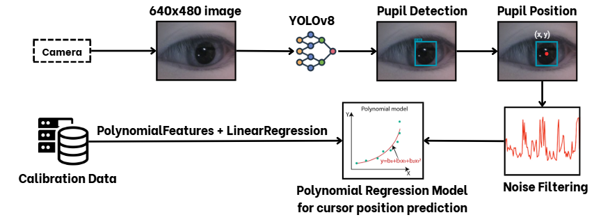
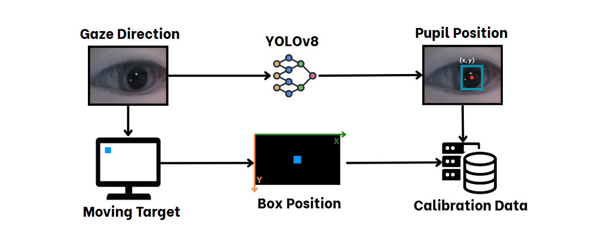
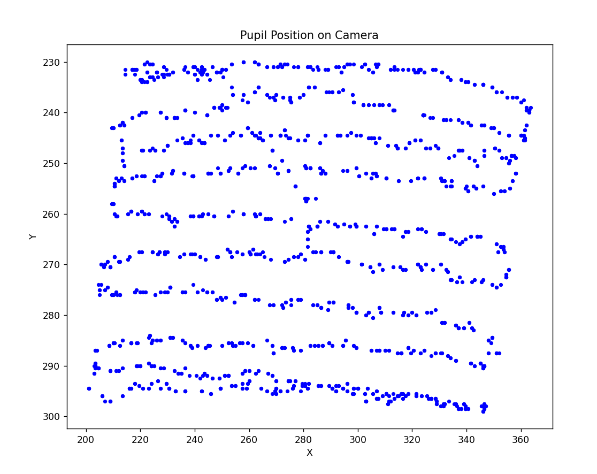
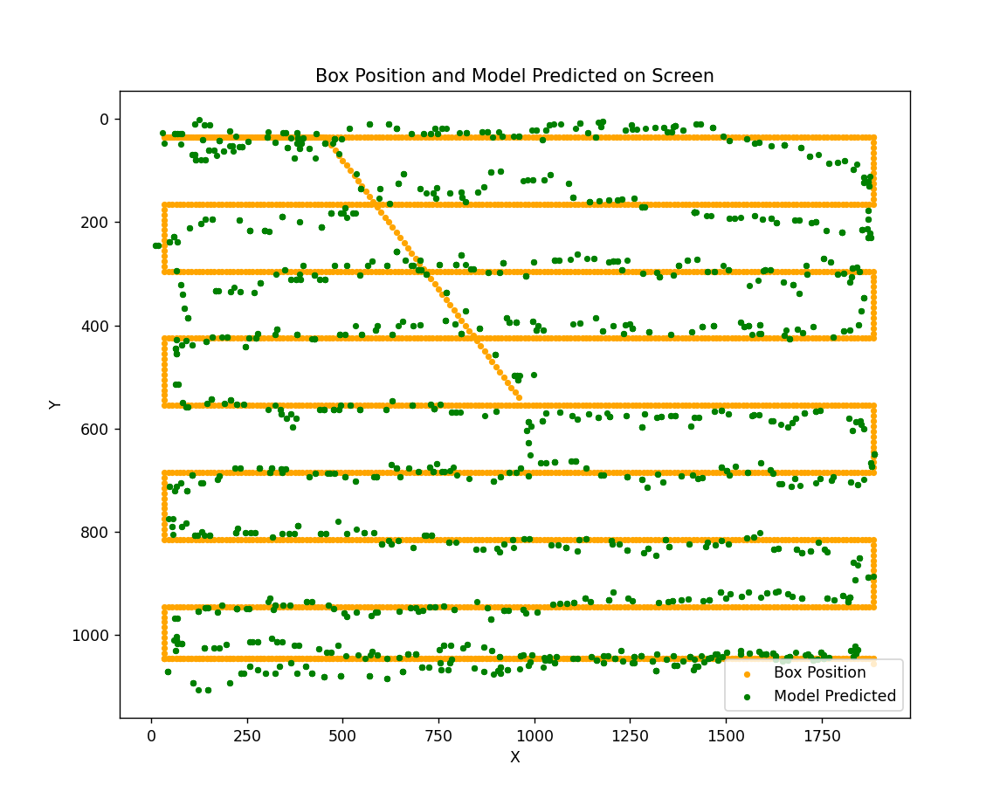

# **Gaze-Controlled-Computer**

  

<i> The operating principle of gaze-tracking mouse control system.</i>

---

## **Abstract**

Patients with severe movement problems, especially those who are completely paralyzed, often cannot move or speak. In these cases, eye movement becomes the main way for them to interact with the environment. However, current support systems are often expensive and require special equipment.
This project presents a low-cost system to control a computer using eye movements. The system uses the YOLOv8 model to detect the pupil in real time and applies polynomial regression to map eye position to the cursor on the screen. Users can move the cursor, click, and scroll by looking and blinking. To make the system more stable, filtering methods such as Kalman filtering and exponential moving average (EMA) are used to create smooth cursor movement.

---

## **Calibration and Gaze-Controlled Result**

The user looks at a moving box on the screen while the system records the pupil position. Each data pair box position and pupil position is saved as calibration data and used to train a model that maps eye movement to cursor position.

  

<i>Figure 1. Calibration process.</i>

  
  

<i>Figure 2. Pupil positions captured from the camera and corresponding box positions with model predictions.</i>

---

## **Contributors**
**Quan Cao**  
**Lam Phuc**
